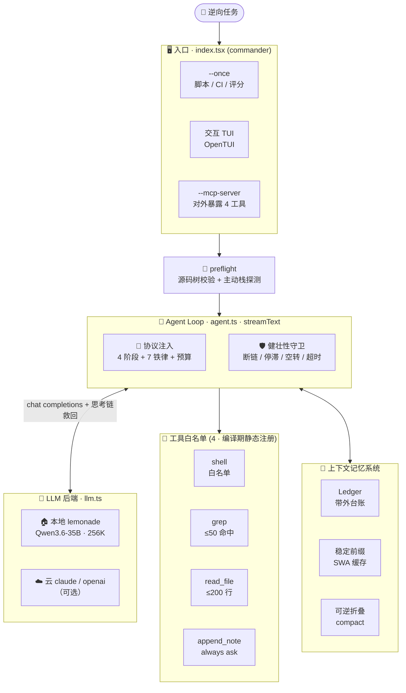
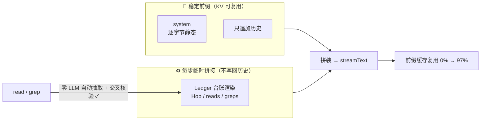
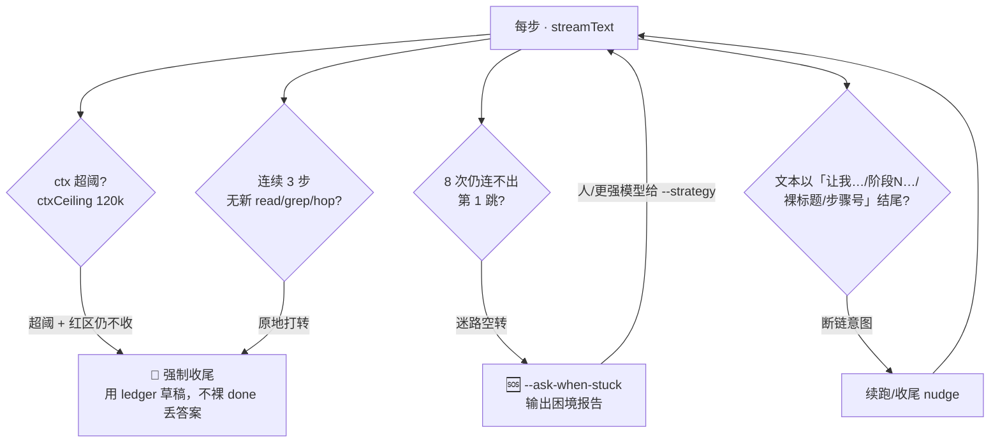

<div align="center">

# 🔍 rev-agent

**本地 LLM Agent CLI · 专为安卓 APK 逆向 · 为小参数本地模型定制的上下文记忆系统**

<br/>


<br/>

> 强制把 **「4 阶段渐进探索协议 + 7 铁律 + Token 预算」** 作为 system prompt 注入，并配一套**针对小参数本地模型**的上下文记忆系统（带外结构化台账 + 稳定前缀 + 断链/空转兜底），
> 让本地模型（默认 **Qwen3.6-35B-A3B MoE，256K 窗口**）在长链路逆向任务上 **可控 · 不发散 · 追完必收尾**。
>
> 参考栈对齐 [Cline CLI](https://github.com/cline/cline/tree/main/apps/cli)（OpenTUI + Vercel AI SDK），但 **agent loop 自己写**，避开 Cline monorepo 的复杂依赖。

</div>

---

## 🗺️ 架构总览



> 📑 **目录** · [技术栈](#-技术栈) · [配置](#️-配置) · [用法](#-用法) · [工具](#-工具白名单) · [记忆系统](#-上下文记忆系统为小参数本地模型定制) · [健壮性](#️-agent-loop-健壮性) · [能力边界](#-能力边界与上限实测标定) · [项目结构](#️-项目结构)

---

## 📦 技术栈

| 层 | 组件 | 版本 |
|---|---|---|
| ⚡ 运行时 | Bun | `>= 1.2` |
| 🤖 LLM 抽象 | `ai` + `@ai-sdk/openai` + `@ai-sdk/anthropic` | `6.0.196` / `3.0.67` / `3.0.81` |
| 🧬 Schema | `zod` | `4.4.3` |
| ⌨️ CLI | `commander` | `14.0.3` |
| 🖼️ TUI | `@opentui/core` + `@opentui/react` | `0.1.102` |
| 🔌 MCP | `@modelcontextprotocol/sdk` | `1.29.0` |

---

## ⚙️ 配置

默认走本地 LAN 上的 lemonade（**Qwen3.6-35B-A3B MoE，已加载**）：

```toml
# ~/.config/rev-agent/config.toml （可选，纯 CLI 参数也行）
backend = "lemonade"
model   = "Huihui-Qwen3.6-35B-A3B-abliterated-ggml"   # ← lemonade 侧已加载的默认模型
baseURL = "http://192.168.9.101:13305/api/v1"          # 你 lemonade 服务地址（LAN，端口 13305，路径 /api/v1）
tokenBudget = 80000
notesPath   = "/tmp/work-notes.md"
```

支持的 backend（默认值逐字取自 `src/llm.ts` 的 `BACKEND_DEFAULTS`）：

| backend | 默认 baseURL | 默认 model | apiKey 来源 |
|---|---|---|---|
| 🏠 `lemonade`   | `http://192.168.9.101:13305/api/v1` | `Huihui-Qwen3.6-35B-A3B-abliterated-ggml` | 内置 `lemonade` |
| 🏠 `lm-studio`  | `http://localhost:1234/v1` | `gemma-3-27b-it` | 内置 |
| 🏠 `ollama`     | `http://localhost:11434/v1` | `gemma3:27b` | 内置 |
| 🏠 `local`      | 必须 `--base-url` 显式 | `gemma-3-27b-it` | 内置 |
| ☁️ `claude`     | 走 Anthropic 云 | `claude-opus-4-7` | env `ANTHROPIC_API_KEY` / `--api-key` |
| ☁️ `openai`     | 走 OpenAI 云 | `gpt-4o` | env `OPENAI_API_KEY` / `--api-key` |
| ☁️ `volcengine` | `https://ark.cn-beijing.volces.com/api/coding/v3` | `doubao-seed-code` | env `ARK_API_KEY` / `--api-key` |

> 🔧 本地端点（lemonade/lm-studio/ollama/local）都走 `provider.chat(model)`（chat completions，**不是** v6 默认的 Responses API，后者本地端点会 404），并挂 `reasoningRewriteFetch` + `withReasoning` 中间件救回思考链（见 [流式与思考链](#-流式与思考链)）。
> `volcengine` 必须用 `/api/coding/v3` 才走 Coding Plan 套餐额度（`/api/v3` 是按量计费）。

> ⚠️ **lemonade #2014 bug**：lemonade 10.x 里 `extra_models_dir` 导入的本地 GGUF 经 OpenAI API 自动加载时会误判为 HF model 触发 `Failed to fetch model info from HF API (404)`。**默认 Qwen3.6 已手动加载不受影响；切其他模型前必须先在服务器侧 `lemonade load <id> [--ctx-size N]` 手动预加载**，且**不要**切 `gemma-4-26B-A4B-it-uncensored`（会立即触发该 bug）。

---

## 🚀 用法

### 🖼️ 交互模式（默认，OpenTUI）

```bash
bun src/index.tsx
```

富 TUI：消息流（user / assistant / 思考链 / tool-call / 结果分色）+ 工作笔记实时预览 + Token 预算进度条 + 工具审批弹窗（按 `y`/`n`）。正文与思考链均为流式增量上屏。

### ⚡ 一次性任务（`--once`，脚本化 / CI / 评分用）

```bash
# 默认 §1 短 system prompt
bun src/index.tsx --once "在 ../work/mt-jadx/sources 里找 MT 2.26.5 的 MCP 入口类" --workdir ../work/mt-jadx/sources

# 复杂任务用 §2 长 prompt（含 7 铁律全文）
bun src/index.tsx --once "追出 MCP 请求处理的完整调用链路，每跳给证据行，最后画链路图" --verbose --workdir <源码树>

# 切 backend
bun src/index.tsx --once "..." --backend claude   # 须设 ANTHROPIC_API_KEY
```

`--once` 下正文走 **stdout**、日志/思考链走 **stderr**（评分脚本只读 stdout）。默认拒绝 write 类工具，加 `--auto-approve` 全放行。

### 🔄 从工作笔记续传（`--resume`）

```bash
bun src/index.tsx --resume --notes /tmp/work-notes.md --once "继续" --workdir <源码树>
```

用 §3 续传 prompt，把上一会话笔记全文注入首条消息、抽出 §4「下一步」接着干；笔记缺失/空则明确报错，不静默退化。

### 🔌 MCP server 模式（`--mcp-server`）

```bash
bun src/index.tsx --mcp-server              # stdio transport，把 4 个工具暴露给 Claude Code / Cursor 反向调用
bun src/index.tsx --mcp-server --allow-write # 放行 ask/write 类工具（默认拒）
```

### 🌐 Web 前端模式（`--web`）

```bash
bun src/index.tsx --web              # 默认端口 5178，浏览器打开 http://localhost:5178
bun src/index.tsx --web 8080 --workdir <源码树>   # 指定端口 + 逆向工件目录
```

把 `Agent` 包成 **Bun.serve 的 HTTP + WebSocket server + 自包含单页前端**（内联 CSS/JS、零外部资源、零新依赖）。浏览器里交互：流式消息（user/assistant/思考流可折叠/tool-call/结果分色，镜像 TUI 配色的暗色终端风）+ 工具审批弹窗（Approve/Deny 或 y/n/Esc 键）+ Token 预算条。与 TUI/`--once` 共用同一个 `Agent` 后端。**lemonade 单并发铁律**：server 用 busy 闸门保证同一时刻只跑一个 agent，拒绝并发提交。

### 🎛️ CLI flags 全表

| flag | 说明 |
|---|---|
| `-b, --backend <name>` | 后端：lemonade/lm-studio/ollama/local/claude/openai/volcengine（默认 lemonade） |
| `-m, --model <id>` | model id（不给按 backend 默认） |
| `-u, --base-url <url>` | 覆盖 baseURL（local backend 必需） |
| `-k, --api-key <key>` | 覆盖 API key（云端 backend） |
| `--verbose` | 用 §2 长 prompt（默认 §1；§9 避坑块自动追加到 §1/§2/§3） |
| `--resume` | 从 `--notes` 笔记续传（§3 prompt） |
| `--once <task>` | 非交互单任务，正文 stdout、日志/思考 stderr |
| `--corpus <dir>` | 🆕 案卷续分析模式：接手强 agent 前置产物目录（MD 结论 / Frida / pcap / dump / 源码树）续查 |
| `--ask-when-stuck` | 原地打转时不强制猜，输出困境报告求思路（TUI 粘贴 / `--once` 报告并 exit=3） |
| `--strategy <text>` | 注入用户/更强模型给的分析思路（承接上一轮困境报告） |
| `--auto-approve` | 所有工具自动放行（仅 --once 建议） |
| `--workdir <path>` | agent 的 cwd（影响 grep/read_file 相对路径，并显式注入模型防路径幻觉） |
| `--budget <tokens>` | Token 预算上限（默认 80000） |
| `--notes <path>` | 工作笔记路径（默认 /tmp/work-notes.md） |
| `--mcp-server` | 进入 MCP server（stdio） |
| `--allow-write` | MCP server 下放行 ask/write 类工具 |
| `--web [port]` | 🆕 Web 前端模式（浏览器交互，Bun.serve WebSocket，默认端口 5178） |
| `-V, --version` | 打印版本立即退出（<200ms，不 import 重模块） |

### 🔧 环境变量开关（框架化 MVP-0..4；均为消融/回退用，默认见括号）

| env | 作用 |
|---|---|
| `REV_GUARD_MODE=count` | 守卫回退到旧的 count-gated 即时强制收尾（默认 `signal`：证据质量门控，难题不早停） |
| `REV_PLAYBOOK=1` | 开启栈感知 playbook 注入（**默认关**：n=5+扩样本消融证 5 道 crack 题 ON 无一更好，默认净负） |
| `REV_LEARN_PLAYBOOK=1` | 开启 MVP-4 从解出轨迹自动生长 learned playbook 落盘 `~/.config`（默认关，避免意外写盘） |
| `REV_AGENT_LEDGER_IN_SYSTEM=1` | 台账放回 system 头部（旧/坏做法，仅 A/B 前缀缓存测；默认拼 messages 末尾＝SWA 铁律） |
| `REV_AGENT_NO_LEDGER_RENDER=1` | 不把台账渲染给模型看（内部仍追踪供守卫用；测「让模型看到台账」本身的价值） |

### ✅ 跑验收

```bash
bun run test          # 全离线单测套件（136 断言：守卫/signal/脱敏/顾问/corpus/playbook/scorer）
bun run demo          # MVP 验收 5 项（scripts/demo.sh）
bash scripts/test-resume.sh   # V0.3 续传验收
bun scripts/test-mcp.ts       # MCP server 端到端
```

---

## 🧰 工具白名单

agent 只能调下面 4 个工具（`ToolRegistry` 编译期静态注册，无插件系统）：

| 工具 | 类别 | 审批 | 说明 |
|---|---|---|---|
| 🐚 `shell` | mixed | 查询 auto / 写入 ask / 危险 deny | 仅白名单内逆向工具（jadx/apktool/apkid/adb/frida/grep/strings/…），`rm -rf / sudo / curl / wget / ssh / dd` 硬拒 |
| 📄 `read_file` | read | auto | 硬限单次 ≤ 200 行（铁律 2 编进 Zod schema，`MAX_LINES=200`） |
| 🔎 `grep` | read | auto | 优先 ripgrep（`--follow` 跟随 symlink），硬限单次 ≤ 50 命中（`MAX_HITS=50`） |
| 📝 `append_note` | write | **always ask** | 追加工作笔记，首次自动 cp 模板 |

审批分级：🟢 `auto`（`aapt2 dump`/`apkid`/`jadx -d`/`grep`/`strings`… 查询）· 🟡 `ask`（`cp`/`mv`/`apktool b`/`apksigner sign`/`adb install`… 写入或副作用）· 🔴 `deny`（`rm -rf`/`sudo`/`curl`/`wget`/`ssh`/`dd`… 危险或外泄）。

---

## 🧠 上下文记忆系统（为小参数本地模型定制）

> 核心痛点：小模型在多跳链路任务上会 **发散**（一直读停不下）、**断链**（宣布下一步却不做 / 追对却不写答案）、**长上下文收尾慢**。



对应机制（`src/agent.ts` + `src/memory/ledger.ts`）：

- 📒 **带外结构化台账 Ledger**：系统在每次 read/grep 后**自动**抽取 reads/greps（零 LLM、不靠模型自律），从正文正则捞出 `跳N: A→B | 证据 file:line` 式 Hop 并与已读范围**交叉核验**（打 ✓）。台账不进 messages（绕 v6 tool-call↔result 配对 bug），只在调用时临时渲染。类名/行号 **verbatim** 存。
- 🧊 **稳定前缀（SWA 优化，治「越聊越卡」）**：`system` 逐字节保持静态，台账改为**每步临时拼到 `messages` 末尾**的 ephemeral 消息、不写回历史。于是 `[静态 system + 只追加历史]` 成为 llama.cpp 可复用的稳定 KV 前缀，每步只重算新增部分——实测前缀复用 **0% → 97%**（台账放 system 头部时每步全量重算）。
- 🗜️ **可逆折叠 compactHistory**：真实上下文超 `compactThreshold`（默认 160k）才启动，把旧 tool-result 换成带 `reread` 指针的轻量 view（逆向场景里指针=磁盘原文件路径，模型用现成 read_file 就能重取）——**折叠 ≠ 删除**。ctx 未逼近上限时不折叠以保稳定前缀。
- ⚡ **收尾 O(1)**：最终链路图由 `renderChainGraph()` 从已积累的 Hop 直接渲染，不在巨上下文里重推。
- 🔗 **零-LLM 调用边派生**（`ledger.ts` `deriveEdges`）：从「已 grep 的符号 + 本次 read 内容」**确定性**派生 `caller→callee` 边——**错边零容忍**（只在找到干净具名外围方法签名时才产边，遇 lambda/合成方法/匿名类边界一律跳过、不猜）。取代靠模型自述「跳N」格式（实测 ✓率仅 26%）。
- 🔓 **去重死锁修复**（`markEvicted`/`hasRead`）：`compactHistory` 折叠驱逐内容后，`hasRead` 只认**未驱逐**范围 → 允许模型重读被折叠的类体，解「stub 让重读 ↔ dedup 又拦住」死锁。

每步都打记忆遥测：`[ctx=… step=… folded=… dedup=… hops=…(✓…) reads=… greps=…]` + `prefix-cache 命中 …%`。

### 🔬 消融检测结果（实测标定，防过度设计）

> 用 20 题 bank-multi 验证 + 单变量消融（3 个 env 开关 `REV_AGENT_LEDGER_IN_SYSTEM` / `NO_LEDGER_RENDER` / `NO_EDGE_DERIVE`）+ 强模型独立核验。**每处设计要么证明有用、要么如实标注不确定——不自欺。** 详见 `docs-resources/上下文记忆系统-架构设计.md §8-§9` 与 `记忆系统-实现交付总结.md`。

| 设计 | 检测裁决 | 硬证据 |
|---|---|---|
| 🧊 稳定前缀（台账拼末尾 vs system） | ✅ **净收益最明确** | 机制层原始实测 **前缀缓存 0%→97%**；消融配对 **+20.5%**（duolingo +47% / kuwo −6%，小样本；先前"+37%均值"经核验为非配对虚高，已订正） |
| 📒 带外 Ledger（自动记账+守卫底座+O(1)收尾） | ✅ 有用 | 演练 reads/greps/hops 自动累积；mtmod-02 边派生 ✓hop=10；守卫测试 30/30 |
| 🔗 零-LLM 边派生 | ⚠️ 情境性有用 + **零空转成本** | 极保守（多数题不触发）但 mtmod-02 触发 +10 条 ✓ 边；6 单测证无错边 |
| ♻️ 台账渲染给模型看 | ⚠️ **依题净正、非普适** | 5-seed：via-02 +0.5 / np-02 +0.2 / chm-01 平 / modv6-02 −0.2 |
| 🔓 死锁修复 / 前缀不变守卫 / 机械判分器 | ✅ 正确性已验证 | `scripts/test-guards.ts` **30/30**、`scripts/score-anchors.py` 确定性离线 |

> ⚠️ **方法论铁律**：本地模型 temp>0 单跑聚合 A/B 是噪声（双峰）——消融必须**同题多 seed 取中位数 + 按题型分指标 + 单变量受控**。据此**有据排除**了 2b-2 写入即落盘 / 阶段4 全量 PageRank / LLM 摘要层（无证据表明需要=不加）。
> **≥20 题验证基线**：20 题跑过，完成 13 / 超时 7，锚点召回均 0.32（完成题 0.41）——诚实反映「易/中题追得干净、难题受 35B 能力上限所限」。

### ❌ 已证伪（阶段0 双否决，不合并）：顺路发现缓存

> 想法：grep/读码时顺路发现的语义（硬编码 key/端点/native 跳转）先留存复用，避免重复读+重复推理浪费 token。深度调研见 `docs-resources/顺路发现缓存-旁路语义记忆-深度分析.md`。**阶段1 MVP 代码 + 阶段0 实测在 `findings-cache` 分支存档（不合入 main）。**

**阶段0 一票否决闸门已实测（`分支 findings-cache` 上 `docs-resources/顺路发现缓存-阶段0闸门-实测.md`）——双否决：**

1. **Q1 痛点真实吗 → ❌**：11 个真实 run `folded=0`（从不折叠），`max_ctx` 5k–28k **远低于折叠阈 160k** → 80k 预算 + SWA 下 ctx 一直很小，没有「被折叠出上下文、需复原」的内容，痛点不存在。
2. **Q2 小模型真会用吗 → ❌**：`--findings-cache` 开 + `append_note` un-gate + auto-approve，6 个 run 里 Qwen3.6 **一次 append_note 都没主动写**（`notes_written=0`）→ 缓存永远空。

**裁决**：与原调研预测一致（消融目标是「证伪无害/证伪没人用」，默认倾向不做）→ **不合入 main**。阶段1 MVP 代码（un-gate + `renderFindingsBlock` 回注末尾管道 + `--findings-cache` 默认关，离线测 11/11、flag 关零变化）作「已验证证伪」制品留 `findings-cache` 分支。边界：只证 --once 自主模式；将来若出现「真会折叠 + 模型真写 note」的工作负载，可从分支复活重跑闸门。

> ❌ 已否决（别再提）：草稿式「正则 findings 引擎」——混淆 APK 上正则非噪即哑，且把未核验猜测以系统权威口吻注入直撞[反幻觉铁律]；offGoal 常驻注入与 context-rot 自相矛盾。

---

## 🛡️ Agent loop 健壮性



- 🚧 **ctxCeiling 硬止损**（默认 120k）：用真实 `contextTokens()`（对当前 messages 估一次，反映真实 prefill）判超阈，而非 `budget.used`（那是 super-linear 累加伪量）；超阈再放行 `maxRedSteps` 步仍不收敛则强制收尾。
- 🔗 **断链兜底 nudge**：无 tool-call 收尾前，若文本以「让我…/换个方式…/进入阶段N…/裸标题/步骤号」结尾（`endsWithContinuationIntent`，移植 opencode finishReason 判据）→ 注入续跑/收尾指令；配额耗尽仍不落答案则**降级为强制收尾**（用 ledger 草稿），不裸 done 丢答案。
- 🥅 **收尾安全网**：台账攒了 ≥1 跳（或有 reads）却从没写「## 最终结论」就想收尾 → 用链路草稿逼补收尾拼图。
- 🛑 **进度停滞硬止损**（`stallCap=3`）：连续多步无新 read/grep/hop（原地打转，如死磕不存在的类）→ 强制收尾报告已确认证据。
- 🧭 **迷路空转干预**（`exploreCap=8`）：多次调用仍连不出第一跳 → 注入「反向追踪」策略提醒，二次仍无进展判定起点难定位、强制收尾报告卡点。
- ⏱️ **两段超时**：首 token 前用宽 `firstTokenTimeoutMs`（300s，本地大模型 prefill 大上下文 + 长 CoT 可能几分钟才吐首字），首 token 后切紧的空闲超时（120s）；配 AbortController。
- 📏 **budget 线性计量**：只累加每步 `outputTokens`（诚实「累计输出成本」），不累加含历史 prefill 的 totalTokens。
- ♻️ **dedup 去重守卫**：重复 read 同范围 / 重复 grep 同 pattern+path → 不真跑，回台账提示。
- 🔁 LLM 可重试错误（网络/5xx/超时/abort）指数退避重试。

### ✅ 已实现并合入 main：把逆向负担从模型移到框架（MVP-0..4）

> 缘起：35B 本地模型逆向能力有上限，纯靠模型效果有限（pi-agent × Qwen3.6 实测印证）。方向 = 把「决策/流程/记忆」负担从弱模型移进框架。**深度分析 + 红队 + 落地设计见 `docs-resources/框架化-把逆向负担从模型移到框架.md`。**
>
> **落地状态（2026-07，分支 `framework-guards` 已 FF 合入 main）**：经多 seed 消融（`框架化-F1-F3-补证据-多seed.md`）定默认——
> - **F1 signal 守卫**：✅ **默认开**（`REV_GUARD_MODE=count` 回退）。难题小胜、易题打平、~1.2× 速度代价。
> - **F2 corpus 锚点自检**：✅ 合入（仅 `--corpus` 模式生效，防错锚点传染）。
> - **F3 playbook 栈感知注入 / MVP-4 自动生长**：⚠️ **默认关**（opt-in `REV_PLAYBOOK=1`）。5 道 crack 题消融 playbook ON 一道都没更好（OFF 胜2/平3/ON胜0）→ 默认不注入，代码+自动生长保留备将来。
> - 判分器 grouped-GT（多破解点）、结论检测 bug 修、离线测（136 断言）一并合入。

**一条铁律（设计红线）**：框架只做两件事——① 按**硬可观测事实**往上下文注入信息，② 按**资源硬上限**收预算；**永不替 agent 决定「下一步动作是什么」或「任务是否完成」**。越线即退化成反编译流水线，丢掉 rev-agent 的独特价值（协议注入 + 深读裁量）。

分阶段 MVP（按 bitter-lesson 半衰期排序，后悔度低的先做）——**均已实现，默认见上**：

1. **MVP-0（离线·零模型·最高优先）**：把 stall/readHopStall 守卫**纯函数化 + 离线单测**，断言 signal-gated——「有活跃线索/在深读」时**不掐停**、只在「原地打转」时 clamp（缩预算而非强制收尾）。
2. **MVP-1（1 次串行复测）**：守卫从 count-gated（步数/墙钟无增长触发强制收尾）→ **signal-gated（证据质量/是否逼近锚点）+ 注入 CHECKPOINT 提示**；`forcedFinish` 仅在墙钟/token **硬上限**触发且标注「资源上限」非「任务完成」；用 `REV_GUARD_MODE=signal|count` 包裹可 A/B。**验收**：EasyNotes 深多跳（rev-agent 现在 reads=0 浅答判错）翻成深读命中，且中难度定点定位不退化。
3. **MVP-2（corpus/advisor 提前加码）**：强化 `corpus.ts`/`advisor.ts`——案卷给真 `file:line` 锚点、执行阶段保留 replan/质疑、fail-closed 脱敏门；加「**错锚点探针题**」验证 agent 不盲信前置分析。（实测 case-file 让 pi 在全混淆题 900s 超时→132s 命中。）
4. **MVP-3（离线）**：`tool-help`/playbook 从被动 grep → 按 stack-probe **确凿匹配的栈主动注入**到 messages 末尾（遵守 SWA 稳定前缀，**只作 context 不作 control**，模型可无视）。
5. **MVP-4（最后·最小）**：第一个程序性 playbook，**优先从 ledger/`--corpus` 解出的轨迹自动生长**，手写策展仅冷启动兜底。

> ❌ 不做：通用**事实** RAG（弱模型检索悖论——实测 `grep tool-help src/` 零命中=模型根本不会主动查）；把 agent 写死成固定线性脚本（丢泛化）；把守卫做成「检测到 X 就强制执行 Y 步」（越铁律红线）。
> ⚠️ 天花板如实：全混淆无 grep 锚点是模型+keyword-grep 联合上限，流程编排救不了；能破壁的动态分析（frida/脱壳）今天 harness 结构上做不了（shell 一次性、无 stdin）→ 唯一可落地破壁通道 = 强模型 case-file/云端顾问（且只「搬动」上限、不「突破」）。

---

## 🌊 流式与思考链

- **streamText + fullStream**：正文（`assistantDelta`）与思考链（`reasoningDelta`）逐 part 实时上屏，消灭本地模型推理期死屏。
- **reasoning_content 救回**：本地 OpenAI 兼容端点（lemonade 等）把思考链放非标 `delta.reasoning_content` 字段，`@ai-sdk/openai` 会静默丢弃。`reasoningRewriteFetch` 拦截 SSE 流把它改写成内联 `<think>…</think>`，再由 `extractReasoningMiddleware({tagName:'think'})` 拆回标准 reasoning part。

---

## 📜 协议层（system prompt 来源）

启动时从 `docs-resources/LLM首轮注入prompt.md` 抽取 prompt（锚点 + code fence）：

| 触发 | section | 内容 |
|---|---|---|
| 默认 | `§1` | 短版 |
| `--verbose` | `§2` | 长版（加意图映射 / 卡住自救 / 笔记纪律） |
| `--resume` | `§3` | 续传 |
| 自动追加 | `§9` | 「通用避坑块」拼到 §1/§2/§3 每节末尾（CTF benchmark 修复沉淀） |

用 `REV_AGENT_PROMPT_PATH` env 或 config 的 `promptPath` 覆盖来源文件。

---

## 📓 工作笔记

工作笔记（默认 `/tmp/work-notes.md`）是 agent 的显式长期记忆：

- 任务超 5 步、token 用 > 70% 时被 prompt 引导调 `append_note`
- 首次写入自动 cp `docs-resources/LLM工作笔记模板.md`
- 跨会话续传见上文 [`--resume`](#-从工作笔记续传--resume)

---

## 🎯 现状与非目标（V0.3）

**✅ 已实现**：4 工具 agent loop · 上下文记忆系统（Ledger + 稳定前缀 + 可逆折叠）· OpenTUI 交互 · `--once` / `--resume` 续传 · `--mcp-server`（对外暴露 4 工具）· preflight 源码级校验 + 🆕 主动栈探测前置 · 🆕 `--corpus` 案卷续分析 · 🆕 `--ask-when-stuck` / `--strategy` 卡住求助闭环 · 7 后端切换。

**❌ 刻意不做**：

| | 项 | 替代方案 |
|---|---|---|
| ❌ | sub-agent / 多 agent 协作 | 单 agent + `--corpus` 摄入他人产物 |
| ✅ | Web UI（`--web`，🆕 已实现） | Bun.serve WS + 单页前端，与 TUI/`--once` 共用 Agent 后端 |
| ❌ | RAG / 向量检索 | grep + 笔记 + 带外台账 |
| ❌ | chroot/docker 沙箱 | 白名单 + timeout + 截断三层兜底 |
| ❌ | 对话持久化 DB | 笔记落 /tmp + 带外 ledger |
| ❌ | 插件系统 | ToolRegistry 编译期静态注册 |
| ❌ | 任何破解 / 绕过类预设 | 只读分析，合规红线 |

---

## 📊 能力边界与上限（实测标定）

> 下面的判断来自对 **9+ 个真实 app**（含破解 mod）跨栈、跨难度**三轮实测** + 强模型质量评审（非关键词），详见 `docs-resources/安全审计-篡改APK破解审计.md` 与 `docs-resources/测试语料广度-技术栈与保护手段矩阵分析.md`。
>
> ⚠️ **重要校准（第 3 轮硬骨头实测）**：能力**随目标难度衰减很快**——可读硬编码破解上优秀（Clone 到期时间戳 **88**、零幻觉），但重混淆/多栈/诱饵密集目标上**平均仅 31/100、半数 major 幻觉**。**别把甜区表现当全域能力。**

### 🟢 能做到（本地 35B + jadx 静态，实测达标）

| 能力 | 实测 |
|---|---|
| 🟢 jadx 可见 dex 静态逆向 | 多跳调用链（≤4 跳起点明确稳定全对；5 跳硬链亦可，如 APK v2/v4 签名链）、类/方法定位、格式常量/协议解析 |
| 🟢 安全审计（点+技术+链路+防御修复） | 破解点是「可读硬编码 getter / 校验短路 / billing stub」时**优秀**：Battery Guru **91** · Podcast Addict **82**，零幻觉，给出服务端复核 / Play Integrity / 签名校验等加固方案 |
| 🟢 强噪音抗干扰定位 | 抖音 5274 文件、NP 20655 文件混淆树里精确锁定目标类 |
| 🟢 native 边界诚实标注 | Java→native 调用**就在眼前**时如实说「逻辑在 .so、需 frida/动态」而不编造（⚠️ 需 `unzip` 才能发现的成分见下方 false-negative） |

### 🟡 上限与边界（做不到 / 需外部介入）

**1️⃣ 工具边界——只看得到 jadx 反编译出的 dex。** 对以下栈业务逻辑**不在** dex 里，**无法深度分析**，只能「识别栈 + 说清逻辑在哪 + 路由到对的工具 + 不幻觉」：

| 栈 | 逻辑载体 | 正确工具 |
|---|---|---|
| Flutter | `libapp.so`（Dart AOT） | blutter / reFlutter |
| Unity | IL2CPP + `global-metadata.dat` | Il2CppDumper |
| React Native | `assets/index.android.bundle`（Hermes） | 专用反汇编 |
| Vue/WebApp | `assets/www/*.js`（Cordova/Capacitor） | 直接读 JS |
| 加固/壳 | dex 运行时解密（乐固/梆梆/爱加密/360） | 动态脱壳 |

> ⚠️ **第 3 轮暴露的失败模式 → ✅ 已实现修复（P1 主动栈探测前置 `src/stack-probe.ts`）**
>
> 无引导 35B 曾常犯 **false-negative**——**不做 `unzip -l` 看 `lib/` 就自信断言「没有 native / 没有 Unity / 纯 Java」**（Duolingo 谎称无 libil2cpp 实则 29MB 在；酷我谎称纯 Java 实则 Hippy/Weex/DexVMP/腾讯加固俱在）。比「幻觉出机制」更隐蔽。
>
> **修复**：开局**确定性**替模型探栈——定位原始 APK → `unzip -l` 看 `lib/*.so`+`assets/` 签名 + 数 dex → 权威栈报告注入首条消息（「检测到 Unity(IL2CPP)、21 个 .so… 严禁断言无 X」）；定位不到 APK 则如实说「看不到 lib/、无法判栈、切勿断言无 X」。**A/B 实测 2/2 修复**：duolingo-1 从 **10 分（幻觉「无 Unity」）→ 正确承认 Unity IL2CPP + 判会员在 dex + 零幻觉**；kuwo-stack **25 → 正确承认 Hippy/加固**。仍建议对高价值判断自己 `unzip -l` 复核。

**2️⃣ 模型能力边界（本地 35B）**：
- 强项：够得着题（≤4 跳、起点有高区分度锚点、破解点是可读硬编码）。
- 边缘（靠安全网兜底或需人/强模型介入）：**多候选精确排除定位**、**重混淆下读不够时易幻觉**（已由「未读方法体不下结论 + 反幻觉铁律」显著缓解——找不到会说「未能证实」而非编造）、**组装完整多部分审计报告**（强混淆样本上仍吃力）。
- 单次运行**非确定**（temp>0）：同题不同跑有波动；安全网保证「稳定下限」（不超时/不跑飞/追对必收尾），非「每次满分」。

**3️⃣ 静态 + 只读 + 合规**：不做动态分析（frida/运行时 hook）；对反调试/root 检测/SSL pinning/完整性校验等只能**识别枚举**（防御审计视角），**不做绕过**；**不产出任何破解/重打包**。

### 🆘 何时需要人 / 更强模型介入

遇到上限（多候选难定位、组装不出完整报告、原地打转）时，用 `--ask-when-stuck`：agent 输出**详细困境报告** → 交给更强模型取思路 → 经 TUI 粘贴 / `--strategy` 反哺续跑。实测该闭环把独立做不出的硬题从 0 分补到满分（详见 `docs-resources`）。

> 💡 **定位**：不是全自动神器，而是 **「本地小模型 + 人/强模型在环」** 做真实逆向的助手——**可控 · 诚实 · 够得着题高效 · 够不着题会明说并求助**。

---

## 🗂️ 项目结构

```
rev-agent/
├── src/
│   ├── index.tsx                CLI 主入口（commander，按 flag 动态 import 一个 runtime，保冷启动快）
│   ├── agent.ts                 Agent 主循环（Plan-Act + 审批 + budget + Ledger 集成，streamText）
│   ├── budget.ts                Token 预算 + 70%/90% 告警（EventEmitter）
│   ├── config.ts                config.toml 加载 + Backend 类型 + DEFAULT_CONFIG
│   ├── llm.ts                   后端切换（BACKEND_DEFAULTS + reasoningRewriteFetch + SUPPORTED_BACKENDS）
│   ├── preflight.ts             P0 源码级任务前置校验（缺源码树秒级 fail-fast 给反编译配方）
│   ├── stack-probe.ts           🆕 P1 主动栈探测（unzip -l 原始 APK → 权威栈报告，防 false-negative）
│   ├── corpus.ts                🆕 P0 案卷续分析模式（scanCorpus manifest + 出处分级协议 + INDEX 契约）
│   ├── prompts.ts               从 docs-resources/LLM首轮注入prompt.md 抽 §1/§2/§3（+ §9 自动追加）
│   ├── resume.ts                V0.3 笔记续传上下文构建
│   ├── memory/
│   │   └── ledger.ts            带外结构化台账（上下文记忆系统·阶段1）
│   ├── runtime/
│   │   ├── run-once.ts          --once / --resume / --corpus 非交互执行（纯 stdout/stderr）
│   │   ├── run-interactive.ts   OpenTUI 交互入口（createCliRenderer + createRoot）
│   │   └── run-mcp-server.ts    --mcp-server：4 工具经 stdio 暴露
│   ├── tools/
│   │   ├── index.ts             ToolRegistry + classify(args)→auto|ask|deny
│   │   ├── shell.ts             白/黑名单 + timeout + 输出截断
│   │   ├── read-file.ts         Zod 强制 ≤200 行
│   │   ├── grep.ts              ripgrep 优先（真实路径解析 + --follow + BSD/GNU -E 兜底）+ ≤50 命中
│   │   └── note.ts              append-only 工作笔记
│   └── ui/
│       ├── App.tsx              OpenTUI 根组件（MessageList + NotesPreview + BudgetBar + 输入框 + 思路粘贴）
│       ├── MessageList.tsx      消息流 scrollbox（分色）
│       ├── NotesPreview.tsx     工作笔记 tail 预览（3s 轮询）
│       ├── BudgetBar.tsx        Token 预算进度条（绿/黄/红）
│       └── ToolApproval.tsx     工具审批弹窗（y/n）
└── scripts/
    ├── demo.sh                  MVP 验收 5 项
    ├── test-guards.ts           健壮性守卫确定性测试（16/16，不依赖 lemonade）
    ├── benchmark-models.sh      多模型实战 benchmark（火山 Coding Plan × 10 + 本地 baseline）
    ├── gen-tool-help.sh         离线生成「递归 --help」文档库 → docs-resources/tool-help/
    ├── test-mcp.ts              MCP server 端到端测试
    └── test-resume.sh           V0.3 续传验收
```

---

## 📚 关联协议文档（`docs-resources/`）

| 文档 | 内容 |
|---|---|
| `LLM首轮注入prompt.md` | system prompt 数据源（§1~§9） |
| `LLM工作笔记模板.md` | 工作笔记模板源 |
| `上下文记忆系统-架构设计.md` | 记忆系统设计 |
| `实跑记录-追MCP请求处理链路.md` | 真实跑 + SWA/收尾优化 A/B（含实测数据） |
| `安全审计-篡改APK破解审计.md` | 三轮篡改 APK 防御审计实测 + P1 A/B |
| `测试语料广度-技术栈与保护手段矩阵分析.md` | 语料广度辩证分析 + 技术栈矩阵 |
| `多Agent协作-强模型前置产物的续分析改进设计.md` | `--corpus` 案卷续分析设计 |
| `如何给rev-agent下达逆向任务-使用指南.md` | 下指令方式 |
| `框架化-把逆向负担从模型移到框架.md` | 框架化三提议深度分析 + 红队 + MVP 路线（缘起） |
| `框架化-feature复盘.md` | MVP-0..4 逐特性 8 问复盘（含两次翻转的诚实记录） |
| `框架化-F1-F3-补证据-多seed.md` | 合并前 n=5+扩样本消融：F1 signal 维持默认 / F3 playbook 证伪不当默认 |
| `框架化-能力测试闭环-10题.md` | 10 题能力测试闭环（找 bug→修→再跑对比 + 归因铁律） |
| `框架化-判分器-多GT改进.md` | grouped-GT 判分 + 一次被对抗式验证推翻的假设 |
| 📄 项目根 `Mac 安卓逆向工具与工作流指南.md` | 主指南：4 阶段渐进 + 7 工作流 |

---

## 🛠️ 开发

```bash
bun install
bun typecheck       # tsc --noEmit
bun lint            # biome check src
bun format          # biome format --write src
bun start           # 跑 src/index.tsx
bun run demo        # MVP 验收
bun run compile     # bun build --compile → dist/rev-agent 单二进制
```

---

## 📄 License

私自使用。基于 [Cline](https://github.com/cline/cline)（Apache 2.0）的设计思路，不分发。

<div align="center">
<sub>🔒 只读分析 · 不产出破解 · 逆向数据不上云 · 合规红线</sub>
</div>
