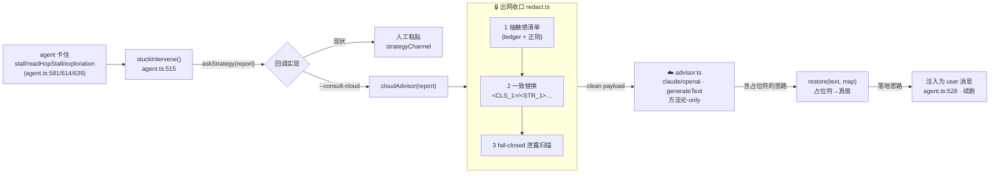

# 混合后端：本地 35B + 云端顾问（脱敏防火墙）— 实现方案

> 目标（按用户确定的架构）：后端**同时**连本地 35B（执行器）+ 云端大模型（顾问 tool）。本地卡住时，把困境报告**脱敏**后自动调用云端获取**思路**，思路回本地落地续跑。云端是"获取思路的途径"，不是主执行器。
> 本文只讲**怎么实现**（取舍讨论见 `混合后端-云端顾问与脱敏防火墙-深度分析.md`，此处不复述）。

## 0. 关键工程杠杆：脱敏用「已知标识符精确替换」，不用模糊 NER

我们不需要靠不可靠的 NER 去"猜"什么是敏感——**台账 `Ledger` 已经 verbatim 存了本次任务碰到的所有类名/方法名/路径/grep pattern**（`ledger.ts`：`ReadEntry.path`、`GrepEntry.pattern`、`Hop.from/to/evidence`）。这给了我们一份**确定性的敏感标识符清单**。脱敏 = 拿这份清单做**精确一致替换**（外加正则兜底 URL/key/path），可逆、高精度。这是整个方案能落地的支点。

## 1. 总体数据流



一句话：**把 `askStrategy` 回调的实现体从「人工粘贴」换成「redact → 云 advisor → restore」，agent 主循环零改动。**

## 2. 新增 / 改动文件

| 文件 | 动作 | 内容 |
|---|---|---|
| `src/redact.ts` | 新建 | 唯一出网收口：`redact()` / `restore()` + 泄露扫描 |
| `src/advisor.ts` | 新建 | `createCloudAdvisor()`：第二个 LLM client（复用 llm.ts）+ 方法论-only prompt + `generateText` |
| `src/llm.ts` | 微改 | 暴露一个只造 client、不进 agent 循环的辅助（已有 `claude`/`openai` 后端可直接用） |
| `src/config.ts` | 加字段 | `consultCloud` / `advisorBackend` / `advisorModel` / `advisorApiKey` / `advisorRedactLevel` / `requireApproval` |
| `src/index.tsx` | 加 flag | `--consult-cloud`、`--advisor-backend`、`--advisor-model`、`--redact-level` |
| `src/runtime/run-once.ts` | 接线 | 构造 `cloudAdvisor` 并作为 `askStrategy` 传给 Agent（`--consult-cloud` 时） |
| `src/runtime/run-interactive.ts` | 接线 | 同上；可选把脱敏后 payload 先过审批弹窗再发 |
| `src/agent.ts` | **零改动** | `askStrategy`/`stuckIntervene`/`buildStuckReport` 已就位 |

## 3. `src/redact.ts` — 可逆脱敏收口

### API
```ts
export type RedactLevel = 0 | 1 | 2;

export interface RedactionMap {
  // 占位符 → 真值（只在内存、请求级；绝不落盘）
  toReal: Map<string, string>;
  // 真值 → 占位符（保证一致替换：同一真值永远同一占位符）
  toToken: Map<string, string>;
}

export interface RedactResult {
  clean: string;        // 脱敏后文本（出网的唯一内容）
  map: RedactionMap;    // 本地保管，用于 restore
  leaks: string[];      // fail-closed 扫描仍疑似泄露的 span（非空 => 调用方应中止或降级）
}

export function redact(
  text: string,
  opts: { level: RedactLevel; knownIdentifiers: string[] }
): RedactResult;

export function restore(text: string, map: RedactionMap): string;
```

### 检测与替换（三层，优先精确）
1. **已知标识符精确替换（核心，来自 ledger）**：`knownIdentifiers` = 从 `ledger` 汇出的所有类名/方法名/包名/路径/grep pattern（见 §4）。逐个做整词一致替换 → `<CLS_n>` / `<PKG_n>` / `<PATH_n>` / `<SYM_n>`。因为是"已知真值"，零漏判。
2. **正则兜底**（catch ledger 之外的内嵌敏感）：
   - 包名 `^([a-z][a-z0-9_]*\.){2,}[A-Za-z]\w*` → `<PKG_n>`
   - URL / IP / email / 绝对路径 → `<URL_n>` / `<IP_n>` / `<EMAIL_n>` / `<PATH_n>`
   - 高熵串（疑似 key/token/base64，Shannon 熵 > 阈值且长度 ≥ 20）→ `<KEY_n>`
   - Android 资源名 `@string/xxx`、`R.string.xxx` → `<RES_n>`
3. **分级旋钮 `level`**：
   - `level 0`：只替换 URL/IP/email/path/key（保留混淆类名——混淆名本身信息量低，利于思路可落地）
   - `level 1`：+ 包名 / 类名 / 方法名
   - `level 2`（最严）：只保留**抽象结构**（把 report 里的标识符全 token 化 + 剥离 grep pattern 原文，只留"我在找一个 boolean getter"这类抽象描述）

### 一致替换实现要点
- 用 `toToken` Map 保证同一真值 → 同一占位符（多轮 consult 里云端能连贯引用 `<CLS_3>`）。
- 占位符编号按类型计数：`<CLS_1>`、`<CLS_2>`…（可选：用 `HMAC(salt, 真值)` 派生稳定后缀，跨 session 一致；若担心跨请求关联则每请求换 salt——见分级）。
- **从长到短**替换，避免子串误伤（先替 `com.a.b.C` 再替 `C`）。
- Map **只在内存、请求级、不落盘**（落盘=再识别密钥）。

### fail-closed 泄露扫描
`redact()` 返回前，对 `clean` 再跑一遍正则（包名/URL/高熵串/绝对路径）；命中即塞进 `leaks[]`。调用方（advisor.ts）见 `leaks` 非空 → **默认中止本次出境**（回退到人工/本地-only），可配 `redactLevel` 提到更严档重试。

### restore
云端返回的思路里会出现 `<CLS_1>` 等占位符 → `restore()` 用 `map.toReal` 全量还原成真类名，再注入本地续跑。还原后本地可用现成 `read_file`/`grep` 去核验（云给方向、本地拿 ground truth）。

## 4. 从 Ledger 汇出 `knownIdentifiers`

`redact.ts` 需要的敏感清单直接从台账取（新增一个导出方法，或在调用处组装）：
```ts
// 在 ledger.ts 加，或在 advisor 调用处用现有 getter 组装
function knownIdentifiersFromLedger(l: Ledger): string[] {
  const s = new Set<string>();
  for (const r of l.reads())  { s.add(r.path); addSymbols(s, r.path); }
  for (const g of l.greps())  { s.add(g.pattern); s.add(g.path); }
  for (const h of l.hops())   { s.add(h.from); s.add(h.to); s.add(h.evidence); }
  return [...s].filter(Boolean).sort((a, b) => b.length - a.length); // 长优先
}
```
> 若 `ledger.ts` 未暴露 `reads()/greps()/hops()`，加三个只读 getter（`toJSON()` 已有全量，可从它取）。

## 5. `src/advisor.ts` — 云端顾问

```ts
import { generateText } from 'ai';
import { createLLM } from './llm.ts';
import { redact, restore, type RedactLevel } from './redact.ts';

const ADVISOR_SYSTEM = `你是安卓逆向"方法论顾问"。你只会看到一个【已脱敏的抽象困境】——
真实类名/方法/字符串已被 <CLS_n>/<STR_n> 等占位符替代。**不要索要真实代码或标识符。**
只输出"下一步该怎么查"的思路/方法论（如：该 grep 什么模式、该验证哪种指纹、常见的短路/恒真/校验旁路套路），
可引用占位符（如"读 <CLS_3> 的方法体确认 <SYM_1> 是否恒真"）。给可执行的探索策略，不要泛泛而谈。`;

export function createCloudAdvisor(opts: {
  backend: string; model?: string; apiKey?: string;
  level: RedactLevel; getKnownIdentifiers: () => string[];
  onEgress?: (cleanPayload: string) => Promise<boolean>; // 可选人工审批门,返回 false 则不发
}): (report: string) => Promise<string | null> {
  const model = createLLM({ backend: opts.backend as never, model: opts.model, apiKey: opts.apiKey });
  return async (report: string) => {
    const { clean, map, leaks } = redact(report, { level: opts.level, knownIdentifiers: opts.getKnownIdentifiers() });
    if (leaks.length) return null;                       // fail-closed:疑似泄露 → 不发,回退
    if (opts.onEgress && !(await opts.onEgress(clean))) return null; // 可选审批门
    const { text } = await generateText({ model, system: ADVISOR_SYSTEM,
      messages: [{ role: 'user', content: clean }],
      abortSignal: AbortSignal.timeout(60_000) });        // 离 lemonade 串行链,独立超时
    return restore(text, map);                            // 占位符→真值,交回 askStrategy 注入
  };
}
```

这个返回值签名**正好是** `agent.ts:102` 的 `askStrategy: (report) => Promise<string|null>`——直接塞进去即可。

## 6. 接线（run-once / run-interactive）

`run-once.ts` 里，构造 Agent 时按 flag 选 `askStrategy`：
```ts
const askStrategy = opts.consultCloud
  ? createCloudAdvisor({
      backend: opts.advisorBackend ?? 'claude',
      model: opts.advisorModel, apiKey: opts.advisorApiKey,
      level: (opts.redactLevel ?? 2) as RedactLevel,
      getKnownIdentifiers: () => knownIdentifiersFromLedger(agent.ledger),
      onEgress: opts.requireApproval ? previewAndConfirm : undefined, // --once 下可打印 clean + 环境变量确认
    })
  : undefined;

const agent = new Agent({
  /* …现有参数… */
  escalateWhenStuck: opts.consultCloud || opts.askWhenStuck,
  askStrategy,                       // ← 云顾问 or 人工通道 or undefined
  maxEscalations: opts.maxConsults ?? 3,
});
```
交互模式同理；`onEgress` 可接 `App.tsx` 的审批弹窗（把脱敏后 `clean` 摊给用户看，send/edit/cancel）。

> `stuckIntervene()`（`agent.ts:515-551`）已经负责：触发 → 调 `askStrategy(buildStuckReport())` → 拿到非空思路则注入 user 消息 + 重置计数续跑 → `null` 则回退强制收尾 / halt。**无需改它。**

## 7. 触发策略（复用现有）

沿用三个行为级硬止损（客观信号，不靠模型自评）：`stall`（连续无新 read/grep/hop）、`readHopStall`、`exploration`（连不出第一跳）。`maxEscalations`（默认 3）封顶。可选增强：把 lemonade 的 logprob 做步级置信度作为**辅助**触发信号（不单独当闸门——小模型自评不可靠）。

## 8. config / CLI

| config 字段 | CLI | 默认 | 说明 |
|---|---|---|---|
| `consultCloud` | `--consult-cloud` | `false` | 总开关 |
| `advisorBackend` | `--advisor-backend` | `claude` | 顾问后端（llm.ts 已支持 claude/openai） |
| `advisorModel` | `--advisor-model` | 后端默认 | |
| `advisorApiKey` | env / `--advisor-api-key` | env | ANTHROPIC/OPENAI key |
| `advisorRedactLevel` | `--redact-level` | `2` | 0/1/2 脱敏档 |
| `requireApproval` | `--consult-approve` | `false` | 出境前人工过目（可选） |
| `maxConsults` | `--max-consults` | `3` | 顾问调用上限 |

## 9. 分阶段实现路线

| 阶段 | 交付 | 可独立验收 |
|---|---|---|
| **P1** | `redact.ts`（`redact`/`restore`/泄露扫描）+ `knownIdentifiersFromLedger` | 单测：造含类名/URL/key/path 的报告，`redact` 后 `clean` 无真值残留、`restore` 完美还原、`leaks` 空 |
| **P2** | `advisor.ts` + llm.ts 辅助 + config/CLI | `--consult-cloud` 手动喂一个 report，端到端跑通：脱敏→云→还原思路 |
| **P3** | run-once/run-interactive 接线（`askStrategy=cloudAdvisor`） | 真实卡住任务：agent 自动求助云端、拿思路续跑（对比现状人工粘贴） |
| **P4** | 可选审批门 `onEgress` + 交互弹窗 + 多档脱敏旋钮 | 出境前预览/否决；切档观察思路质量 vs 脱敏面 |
| **P5** | 触发增强（logprob 步级置信度）+ 遥测（consult 次数/成功率/思路是否被本地核验采信） | scorecard 加 `consults=N advisorAdopted=M` |

## 10. 测试方案（测"不足"）

1. **脱敏泄露测（P1 必过门）**：构造覆盖包名/类名/方法/URL/IP/key/绝对路径/grep-pattern 的困境报告样本集，跑 `redact`，正则 + 人工双查 `clean`——**任一真敏感串残留即不通过**（fail-closed 验收）。含"ledger 之外的内嵌 key/URL"用例专测正则兜底。
2. **还原正确性**：`restore(cloudReply, map)` 把占位符 100% 还原、无错配、无把非占位符文本误还原。
3. **端到端 A/B（P3）**：同一批 Round-3 硬骨头题，**本地-only vs 本地+云顾问**，比：卡住后是否提升定位/降幻觉/减介入次数；顾问思路是否被本地 ledger 核验后采信（provenance）。保留纯本地 baseline 防 eval 失真。
4. **鲁棒性**：云超时/不可用 → 是否干净回退（不阻塞 lemonade 串行链、不裸 done 丢答案）；`leaks` 非空 → 是否中止出境。
5. **一致性**：多轮 consult 里同一真值是否稳定映射同一占位符（云端能连贯引用）。

## 11. 骨架清单（可直接开工）

```
src/redact.ts        # detect(3层) + 一致替换 + 泄露扫描 + restore
src/advisor.ts       # createCloudAdvisor → (report)=>Promise<string|null>
src/llm.ts           # +createAdvisorClient(复用 createLLM,不进 loop)
src/config.ts        # +consultCloud/advisorBackend/advisorModel/advisorRedactLevel/requireApproval/maxConsults
src/index.tsx        # +--consult-cloud/--advisor-backend/--advisor-model/--redact-level/--consult-approve/--max-consults
src/runtime/run-once.ts / run-interactive.ts   # askStrategy = consultCloud ? createCloudAdvisor(...) : 现有通道
src/memory/ledger.ts # +reads()/greps()/hops() 只读 getter(若未暴露)
tests: scripts/test-redact.ts  # 泄露门 + 还原门(不依赖 lemonade,确定性)
```

## 关联
- `混合后端-云端顾问与脱敏防火墙-深度分析.md`（设计取舍/权衡讨论——本文只实现）
- 现有机制：`agent.ts:102`（`askStrategy`）/ `agent.ts:515-551`（`stuckIntervene`）/ `agent.ts:492-508`（`buildStuckReport`）/ `llm.ts`（claude/openai 后端）
- 参考实现：Gaze 可逆伪匿名 runtime、LLM Guard Anonymize/Deanonymize 双向 Vault、PlanTwin 脱敏网关、Anthropic Advisor Tool（executor/advisor 模式）
