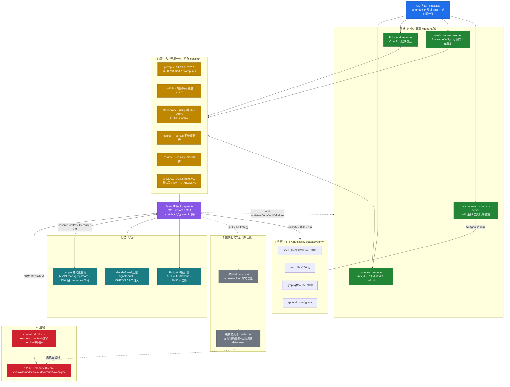
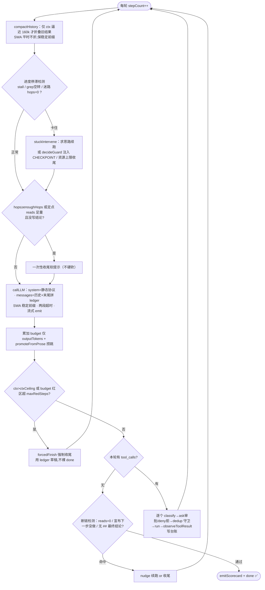

# Architecture

rev-agent = 自研轻量 TS/Bun agent CLI，把用户手写的**「4 阶段渐进探索协议 + 7 铁律 + Token 预算」**强制作为 system prompt 注入，驱动本地 lemonade 后端（Qwen3.6-35B-A3B MoE）专做安卓 APK **只读**逆向。一个 `Agent`（EventEmitter）核心，4 个前端共享；决策/记忆/守卫/安全都在框架里，模型只管「读码+推理」。

> 详细机制逐条见 **[[Mechanisms]]**；实测对比见 **[[Comparisons]]**；题库示例见 **[[Showcase Benchmark Questions]]**。

## 端到端数据流（上下游）

## Agent 单步循环（Plan-Act）

## 组件速查（按层）

| 层 | 组件 | 文件 | 职责 |
|---|---|---|---|
| 入口 | CLI | `src/index.tsx` | commander 解析全部 flags，短路分发到 4 前端，懒加载重模块保冷启动 |
| 前端 | run-once | `src/runtime/run-once.ts` | 非交互单任务，流式进 stdout 供评分；卡住可 exit=3 |
| 前端 | run-interactive + App | `src/runtime/run-interactive.ts` + `src/ui/App.tsx` | 默认 OpenTUI 交互，审批弹窗 + 卡住粘贴思路通道 |
| 前端 | run-web-server | `src/runtime/run-web-server.ts` | Bun.serve HTTP+WS，busy 闸门守 lemonade 单并发 |
| 前端 | run-mcp-server | `src/runtime/run-mcp-server.ts` | stdio 把 4 工具暴露给 Claude Code/Cursor 反向调用（绕 Agent） |
| Agent 核心 | Agent | `src/agent.ts` | 单步 Plan-Act 循环 + 手动 dispatch + 断链/止损/折叠/求助 + emit 事件 |
| 记忆 | Ledger | `src/memory/ledger.ts` | 带外结构化台账，自动抽 reads/greps、派生调用边、交叉核验；render 拼 messages 末尾 |
| 守卫 | decideGuard | `src/guards.ts` | 纯函数止损（signal/count），CHECKPOINT 注入，仅资源硬上限 finish |
| 守卫 | Budget | `src/budget.ts` | Token 线性计量（只加 outputTokens），70/90% 告警 |
| 工具 | ToolRegistry | `src/tools/index.ts` + `tools/*` | 4 白名单工具，Zod 校验 + classify(auto/ask/deny) + 手动 dispatch |
| 后端 | createLLM | `src/llm.ts` | AI SDK v6 LanguageModel，reasoning_content 改写 fetch + extractReasoning 中间件 |
| 协议 | prompts / preflight / stack-probe / corpus / resume / playbook | `src/prompts.ts` 等 | 开局前置注入（协议 §1-§9 / 源码树校验 / 主动探栈 / 案卷 / 续传 / 套路） |
| 安全 | advisor + redact | `src/advisor.ts` + `src/redact.ts` | 卡住→脱敏困境报告→云端拿方法论→还原续跑；唯一出网收口，fail-closed |

**一条设计铁律贯穿全图**：框架只做两件事——① 按**硬可观测事实**注入 context，② 按**资源硬上限**收 budget；**永不替 agent 决定「下一步动作」或「任务是否完成」**。越线即退化成反编译流水线。
