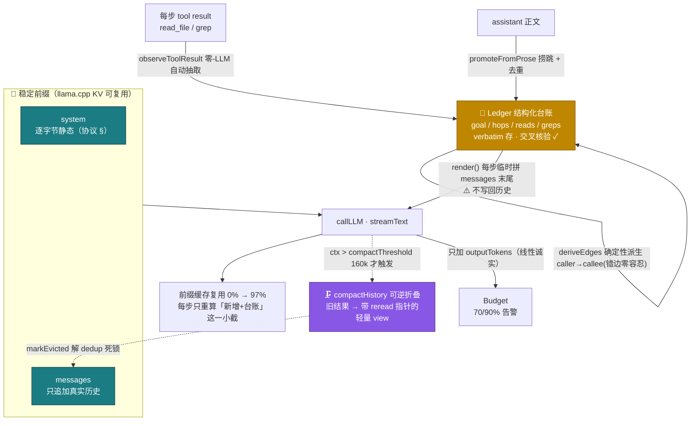

# Context Memory System（上下文记忆系统）

> 为**小参数本地模型**（Qwen3.6-35B-A3B，256K 窗口）× **超大反编译产物**（单 App 常 2万~6.5万 Java 文件）定制的记忆层。它是 rev-agent 区别于"裸提示驱动模型"的核心之一：把弱模型的**记忆/自律/长上下文**短板搬进框架。
>
> 机制逐条见 **[[Mechanisms]]** 的「SWA 稳定前缀」+「记忆」两节；SWA 铁律见 **[[Iron Laws]]**。

## 为什么需要它

小模型在多跳链路任务上有三个稳定失败模式，加上一个性能陷阱：

| 症状 | 表现 | 记忆系统的对策 |
|---|---|---|
| **发散** | 一直读、停不下来，追到 maxSteps | 结构化台账让守卫看得见"进展"，配合 [[Mechanisms]] 的止损 |
| **断链** | 宣布下一步却不做 / 追对了却不写答案 | 台账 O(1) 收尾草稿 + 断链 nudge |
| **收尾慢** | 长上下文里重推链路图 | `renderChainGraph()` 从已积累 Hop 直接渲染 |
| **越聊越卡** | ctx 变长后每步全量重算 | **SWA 稳定前缀**（下详） |

根因：小模型**不自律写台账**、**转述会丢精度**（类名/行号被改写），且 llama.cpp 的滑窗注意力（SWA）对"前缀是否逐字节稳定"极其敏感。

## 记忆数据流

## 核心机制（`src/agent.ts` + `src/memory/ledger.ts`）

- 📒 **带外结构化台账 Ledger**（`ledger.ts:53`）：系统在每次 read/grep 后**自动**抽取（零 LLM、不靠自律），从正文正则捞 `跳N: A→B｜证据 file:line` 升级为 Hop 并与已读范围**交叉核验**（打 ✓）。台账**不进 messages**（绕开 AI-SDK v6 的 tool-call↔result 配对 bug），只在调用时临时渲染；类名/行号 **verbatim** 存，绝不 LLM 转述。
- 🧊 **SWA 稳定前缀**（`agent.ts:322`）：`system` 逐字节静态，台账改为**每步临时拼到 `messages` 末尾**、不写回历史。于是 `[静态 system + 只追加历史]` 成为可复用 KV 前缀，每步只重算新增部分——**实测前缀复用 0%→97%**（台账放 system 头部时每步全量重算＝越聊越卡）。
- 🗜️ **可逆折叠 compactHistory**（`agent.ts:441`）：真实 ctx 超 `compactThreshold(160k)` 才启动，把旧 tool-result 换成带 `reread` 指针的轻量 view（逆向场景里指针＝磁盘原文件路径，模型用现成 read_file 就能重取）——**折叠 ≠ 删除**。ctx 没逼近上限时不折叠以保稳定前缀。
- 🔗 **零-LLM 调用边派生**（`ledger.ts:113`）：从「已 grep 符号 + 本次 read 内容」**确定性**派生 `caller→callee` 边——**错边零容忍**（只在找到干净具名外围方法签名时才产边，遇 lambda/合成方法/匿名类边界一律跳过）。取代靠模型自述"跳N"（实测 ✓率仅 26%）。
- 🔓 **去重死锁修复**（`ledger.ts:223` `markEvicted`/`hasRead`）：折叠驱逐内容后 `hasRead` 只认**未驱逐**范围 → 允许重读被折叠的类体，解「stub 让重读 ↔ dedup 又拦住」死锁。
- ⚡ **收尾 O(1)**（`ledger.ts:255` `renderChainGraph`）：最终链路图从已积累 Hop 直接渲染，不在巨上下文里重推。
- 📏 **budget 线性计量**（`agent.ts:756`）：每步只加本轮 `outputTokens`；`totalTokens` 含增长历史 prefill，累加是 super-linear 伪量（实测伪 123k vs 真实 ctx 6.7k）。`contextTokens()`（`agent.ts:402`）才是判断上下文是否失控、驱动折叠/硬止损的诚实标尺。

每步都打记忆遥测：`[ctx=… step=… folded=… dedup=… hops=…(✓…) reads=… greps=…]` + `prefix-cache 命中 …%`。

## 🔬 消融检测结果（实测标定，防过度设计）

用 20 题 `bank-multi` + 单变量消融（3 个 env 开关 `REV_AGENT_LEDGER_IN_SYSTEM` / `NO_LEDGER_RENDER` / `NO_EDGE_DERIVE`）+ 强模型独立核验。**每处设计要么证明有用、要么如实标注不确定——不自欺。**

| 设计 | 裁决 | 硬证据 | 开关 |
|---|---|---|---|
| 🧊 稳定前缀（台账拼末尾 vs system） | ✅ **净收益最明确** | 机制层 前缀缓存 **0%→97%**；消融配对 **+20.5%**（duolingo +47% / kuwo −6%，小样本；先前"+37%均值"经核验为非配对虚高，已订正） | `REV_AGENT_LEDGER_IN_SYSTEM=1` |
| 📒 带外 Ledger | ✅ 有用 | reads/greps/hops 自动累积；mtmod-02 边派生 ✓hop=10；守卫测试 30/30 | `REV_AGENT_NO_LEDGER_RENDER=1` |
| 🔗 零-LLM 边派生 | ⚠️ 情境性有用 + **零空转成本** | 极保守（多数题不触发）但 mtmod-02 触发 +10 条 ✓ 边；6 单测证无错边 | `REV_AGENT_NO_EDGE_DERIVE=1` |
| ♻️ 台账渲染给模型看 | ⚠️ **依题净正、非普适** | 5-seed：via-02 +0.5 / np-02 +0.2 / chm-01 平 / modv6-02 −0.2 | `REV_AGENT_NO_LEDGER_RENDER=1` |
| 🔓 死锁修复 / 前缀不变守卫 / 机械判分器 | ✅ 正确性已验证 | `test-guards.ts` 30/30、`score-anchors.py` 确定性离线 | — |

> ⚠️ **方法论铁律**：本地模型 temp>0 单跑聚合 A/B 是噪声（双峰）——消融必须**同题多 seed 取中位数 + 按题型分指标 + 单变量受控**。据此**有据排除**了：2b-2 写入即落盘 / 阶段4 全量 PageRank / LLM 摘要层（无证据表明需要 = 不加）。
> **≥20 题验证基线**：20 题跑过，完成 13 / 超时 7，锚点召回均 0.32（完成题 0.41）——诚实反映「易/中题追得干净、难题受 35B 能力上限所限」。

## 设计取舍（为什么长这样）

- **带外而非进 messages**：绕开 v6 配对 bug + 台账变动不污染稳定前缀。
- **零-LLM 自动抽取而非让模型写**：小模型不自律写台账，且自述"跳N"格式 ✓率仅 26%。
- **verbatim 存而非摘要**：逆向产物（`op4.java:71`、`Inventory$PowerUp.isPlusSubscription`）差一个字符就无法核对；摘要层被消融证伪、不加。
- **折叠有阈值而非总开**：折叠改历史中段＝破坏稳定前缀＝全量重算；256K 装得下时保前缀最省，只有逼近上限才折一次止血。

> 相关：设计全文 `docs-resources/上下文记忆系统-架构设计.md`；SWA 稳定前缀铁律见 [[Iron Laws]]；被证伪的"顺路发现缓存"（阶段0 双否决）见 [[Roadmap]]。
