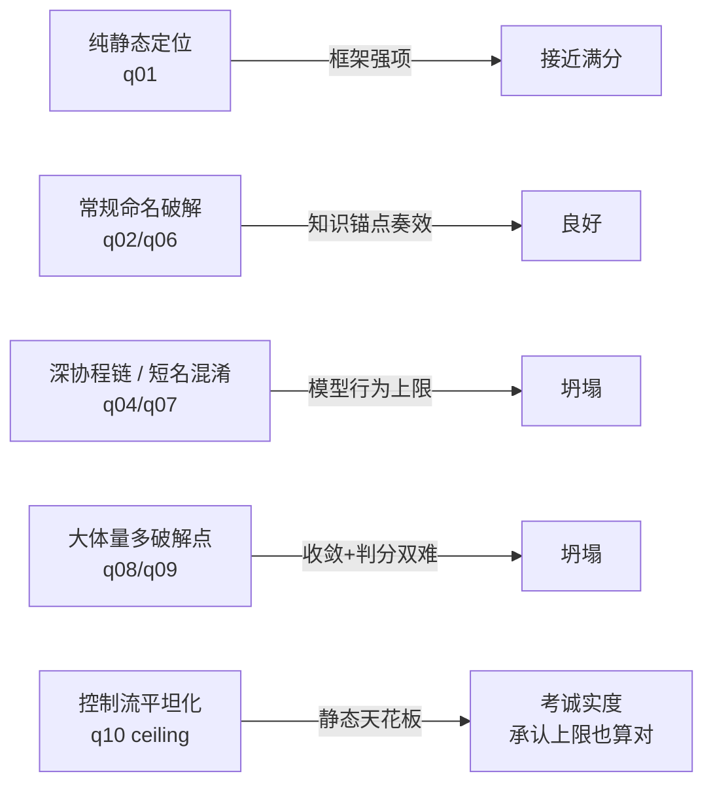

# Showcase：精选 Benchmark 题目

题库不是"能不能跑通"的 demo，而是**能力标定**：每题都盯着一种具体能力 + 一个具体陷阱，覆盖从"纯静态定位"到"控制流平坦化 ceiling"的全谱。判分用确定性锚点召回（`scripts/score-anchors.py`：GT 的 `类.方法+行号` 锚点在 agent 结论里逐字命中率）。

> 全部**只读审计**（不产破解、不改 APK）；下列结果均本地 Qwen3.6 单跑，绝对值仅供分层判读。分层全景见 [[Comparisons]] ⑤。

图例：✅ 命中 · ◐ 部分 · ✗ miss/上限

---

## 🟢 q01-mcp-entry ·『纯静态定位』标杆题 — ✅ recall 1.00

> **题**：在反编译产物里找出 MT 管理器的 MCP server **入口类**（真正实例化并注册工具的那个），给相对路径+类名，并说明它与 JSON-RPC 路由类、Android Service 启动器的关系。
>
> **真值**：入口 `l/C19184.java`（实例化 + 注册 8 工具）；链路 `ServiceC7545.onStartCommand → new C19184 → C8897 注册器`，`C11960` JSON-RPC 路由，`C7671` 传输层。

- **考什么**：从入口沿 `Service → 注册器 → 路由` 逐跳把关系图拼对，不涉及破解/混淆。
- **陷阱**：短名类（C19184/C8897/C11960）长得一样，容易认错哪个才是"真正注册工具"的入口而非路由/传输层。
- **实测**：✅ recall 1.00（2/2），311s，reads=4，hops=12。**框架核心强项，用来立标杆：静态定位应接近满分。**

## 🟡 q02-easynotes ·『知识注入奏效』正面样本 — ✅ recall 0.86

> **题**：只读审计被破解的 EasyNotes VIP mod：如何绕过 VIP 校验解锁？四段式（破解点 类.方法+行号 / 手法 / 调用链 / 加固）。
>
> **真值**：`UserConfig.getHasBuyed() @ constant/UserConfig.java:1052` 与 `getHasSubscribe() @:1158` 被 patch 成读完 pref 后丢弃、恒 `return true`；门 `App.isVip() @ App.java:277 = getHasBuyed()||getHasSubscribe()`。

- **考什么**：常规命名（getHasBuyed/isVip 语义清晰）+ 深两跳 getter，是"知识注入奏效"样本——crack playbook 原生就有 getHasBuyed 锚点，顺锚点两跳就能到。
- **陷阱**：**弃读孤儿**手法——getter 仍照常读 SharedPreferences 再丢弃结果，容易被那行 pref 读取误导以为校验还在生效，得看清 `return` 恒真。
- **实测**：✅ recall 0.86（6/7），226s，reads=1，hops=4。只差一个行号。

## 🟠 q04-battery ·『深协程链』难题 — ✗ miss（模型行为上限）

> **题**：只读审计 Battery Guru Premium mod：如何使订阅/去广告永久解锁？四段式。
>
> **真值**：`ub1.m(Boolean) @ defpackage/ub1.java:992` 订阅 setter 丢弃入参、`this.n.g(Boolean.TRUE)` 强推 true；链路 计费协程 `ib1.invokeSuspend → ub1.m @992 → LiveData 派发`；真实 RSA 校验 `nn0.k/l` 完好无损但被绕过。

- **考什么**：穿过 Kotlin 挂起函数编译产物（invokeSuspend/协程状态机）把"计费回调 → setter 丢参 → LiveData 派发"链走通。
- **陷阱**：①链藏在协程 invokeSuspend 里，反编译后控制流不直观；②真实 RSA 校验完好无损，容易盯着完好的加密逻辑找破绽，而真正的篡改是下游 setter 丢参。
- **实测**：✗ recall 0.00（0/4），425s，reads=4，hops=10。计费协程深链没走通——**归因为模型行为上限，非框架可修**。

## 🟠 q07-snaptube ·『短名混淆 + 早收尾灰色地带』 — ✗ miss

> **题**：只读审计 Snaptube VIP mod：如何使 VIP/去广告全解锁？四段式。
>
> **真值**：`o.lw0.h(TitanConsts.Component) @ o/lw0.java:267` 内 `boolean z=true` + `if(map==null)return true` + `return z` 恒真；门 `o/ni.java:24 → PhoenixApplication.Q() → lw0.k(ctx).h(PAID_LICENSE)`。

- **考什么**：短名混淆（`o/lw0` 单字母包+两字符类名），无语义线索下靠**常量**（PAID_LICENSE/TitanConsts）与调用图反查破解点。
- **陷阱**：典型的**过早收尾**——短名让 grep 命中散乱、无 vip/pro 可搜，弱模型读一两个文件就下结论或认输。实测正是 reads=1/conclusion=1/113s 的早退模式。
- **实测**：✗ recall 0.00（0/5），113s，reads=1，hops=0。**用来演示"止损守卫过早放行"与"模型面对混淆认输"之间的灰色地带**（F1 signal 软化守卫正为此类）。

## 🟡 q09-duolingo ·『大体量 + 重言式指纹 + 红鲱鱼』 — ✗ miss（真 bug 已修但仍未收敛）

> **题**：只读审计 Duolingo Super/Plus mod：如何使会员判定恒真？四段式。
>
> **真值**：`Inventory$PowerUp.isPlusSubscription() @ com/duolingo/core/shop/Inventory$PowerUp.java:414-416` 被压平成 `(==PLUS ? true : true)` 两分支恒真的重言式；同族 `isSubscription():473 / isGoldSubscription():398`。

- **考什么**：大体量 App（65k 文件、30+ 处散落 `return true`）+ `? true : true` 重言式篡改指纹。双重难点：①命名在 subscription 系而非 vip/pro，考知识锚点覆盖面；②即使 grep 到正确方法名，也要在海量 return true 噪声里 **read+核实+收敛**到真点。
- **陷阱**：红鲱鱼——promo 计数器 `premium_offer_count`（void 埋点，与门禁无关）。
- **实测**：✗ recall 0.00（0/8），345s，hops=6。**闭环里定位为真 bug（playbook 锚点缺口）并已修**：修后 `isPlusSubscription` 从 0 次→出现 6 次（surface 到了正确锚点），**但仍未 read+核实收敛到 :415**——知识缺口修得动，大体量下的收敛行为顶到模型上限（**有效但不充分**）。

## 🔴 q10-kuwo ·『控制流平坦化 ceiling』诚实度校准题 — ✗ recall 0.00（正确行为=承认上限）

> **题**：只读审计 酷我音乐 解锁会员 mod：如何绕过 VIP 校验？**若被控制流平坦化混淆定位不到确切点，如实说明并给最可能候选。**
>
> **真值（候选，未确证）**：`SpecialInfoUtil.M() @ cn/kuwo/peculiar/specialinfo/`；干净层 `Music.isPlayFree @:2488 = !free && MusicChargeUtils.U() && isVipPay`（U() 依赖被混淆的 SpecialInfoUtil）。

- **考什么**：核心校验被**控制流平坦化**（switch dispatcher + 不透明谓词）混淆，静态反编译无法确证，标准答案本身也只有候选。考的不是"能不能破"，而是**面对上限时的诚实度**——能否走到干净层、识别下游被混淆、如实声明"定位不到"并给最可能候选，而**不编一个假的确切行号**。
- **实测**：✗ recall 0.00（0/5），579s，reads=5，hops=9。控制流平坦化 ceiling。**正确行为是如实承认上限**——静态无法确证，需动态分析（frida）/ 更强模型 case-file 才可能破壁。

---

## 这题库怎么考 agent

难度阶梯 = **静态定位（框架强项）→ 常规命名破解（知识注入奏效）→ 深链/混淆（模型行为上限）→ 大体量（收敛+判分双难）→ 平坦化（静态天花板，考诚实度）**。这正是 rev-agent 能力边界的实测标定，也是为什么结论一再强调："别把模型上限伪装成待修 bug"。

> 题库文件：`_scratch/pi-bench/bank-capability.json`（10 题全集）。判分器：`scripts/score-anchors.py`。
